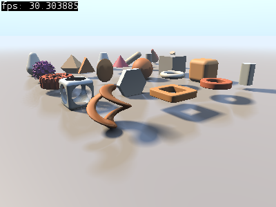

# shadertoy

Shadertoy program implementuje shadertoy.com fragment shader (gles2) player, takže je možné púštať shadertoy shader programi bez nutnosti pripojenia na sieť. Shadertoy naviše umožnuje pozastaviť a následne krokovať simuláciu pomocou kláves `p` (pause) a `.` (next frame).

Ovládanie: `O` - open shader file, `R` - reload shader program, `E` - edit shader program, `P` - pause program, `.` - next frame a `H` - show help.
