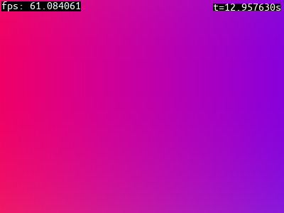
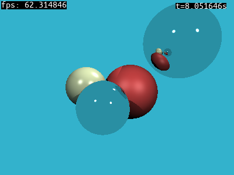
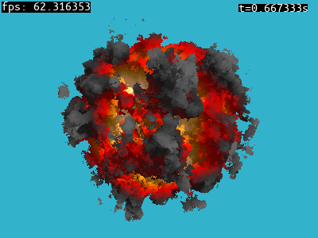

# shadertoy

[shadertoy.com](https://www.shadertoy.com, "shadertoy web page") fragment shader player pre *gles2* kompatibilné programy. Shadertoy umožuje pozastaviť a krokovať simuláciu pomocou kláves `p` (pause) a `.` (next frame) viz. sekcia ovládanie.


**Ovládanie**: `O` - open shader file, `R` - reload shader program, `E` - edit shader program, `P` - pause program, `.` - next frame a `H` - show help.

## spustenie

Shadertoy spustíme príkazom

```
shadertoy [SHADER_FILE]
```

, kde `SHADER_FILE` je cesta k [shadertoy.com](https://www.shadertoy.com, "shadertoy web page") kompatibilnému shader programu.


## kompilácia

Skompilujeme príkazom

```bash
scons -j8
```

z adresára `shadertoy`.

## ukážka

Časovo premenlivý gradient pozadia




```glsl
// shadertoy hello shader
void mainImage(out vec4 fragColor, in vec2 fragCoord)
{
   // Normalized pixel coordinates (from 0 to 1)
   vec2 uv = fragCoord/iResolution.xy;

   // Time varying pixel color
   vec3 col = 0.5 + 0.5*cos(iTime+uv.xyx+vec3(0,2,4));

   // Output to screen
   fragColor = vec4(col,1.0);
}
```

pozri `hello.glsl`.

Pre ďalšie ukážky pozri `reflection.glsl`, `explosion.glsl`, alebo `primitives_samples.glsl` (obrázok z úvodu). 

 

